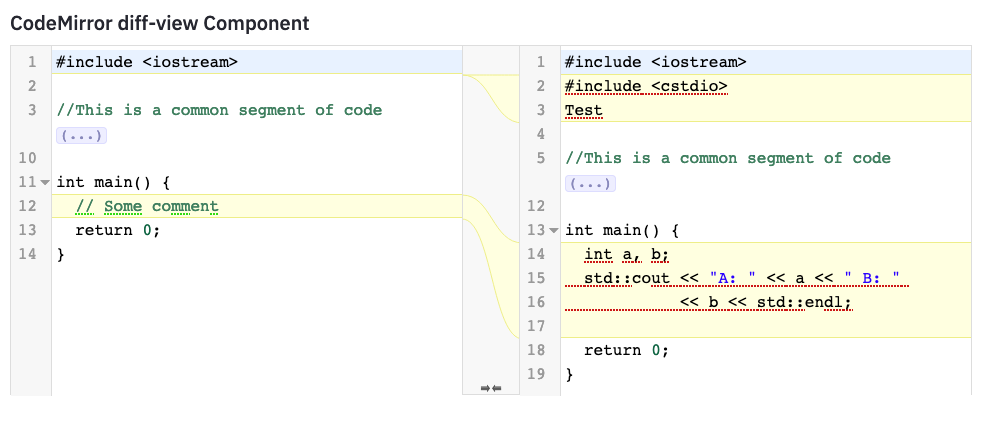

## Streamlit diff-view component

Streamlit component for viewing diffs between blobs of text. This component is a wrapper around the CodeMirror component, exposing the diff view capability. 

### Development 

  - Backend
    + Install [Poetry](https://python-poetry.org/)
    + Run `poetry intall`
    + Drop into a virtualenv shell `poetry shell`
    + Edit `st_codemirror_diff/__init__.py` change `_RELEASE` to `False` 
    + Run `streamlit run st_codemirror_diff/__init__.py`
  - Frontend
    + `cd st_codemirror_diff/frontend`
    + `npm install`
    + `npm start`
  - Now the frontend and backend should be up, the page can be accessed at `http://localhost:8501`

### Development - Release
  - Frontend
    + Run `npm run build` in `st_codemirror_diff/frontend`
  - Backend
    + Edit `st_codemirror_diff/__init__.py` change `_RELEASE` to `True`
    + Drop into python virtualenv by running `poetry shell`
    + Build python dist wheels `python setup.py sdist bdist_wheel`
    + This will create the python `st_codemirror_diff-<version>-py3-none-any.whl` in the `dist` dir
    + Now install this via `python -m pip install <path-to-st_codemirror_diff.whl>`

### Screenshot

### Known Issues
1. Red and Green 'squiggles' in the CodeMirror windows. This is due to some check that is being performed by CodeMirror. 

### Credits

1. [Streamlit](https://streamlit.io/) 
2. [CodeMirror](https://codemirror.net/) 